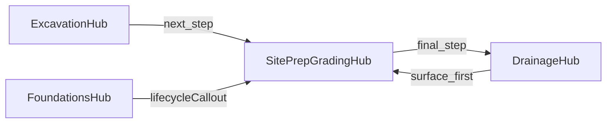

# Site Preparation & Grading silo (Master Directive + Precision Silo copy)

## Pre-flight (human)

- **Git:** Prefer a dedicated branch before Composer (e.g. existing `feature/grading-and-site-prep` or `feature/grading-restructure`).
- **Renumber:** After adding the mega-menu card, `num` on all six cards must run **01–06** sequentially.
- **Home marquee:** Update homepage marquee content (sourced from [`home.json`](glc-site/src/content/pages/home.json) sections) so it references **Site Prep & Grading** alongside other lines.
- **CAT hero asset (professional URL path):** Rename source file (e.g. `FB_IMG_1762459279835.jpg`) to **`cat-skid-steer-grading-simcoe-county.jpg`** and place it at **`glc-site/public/images/services/site-preparation-grading/cat-skid-steer-grading-simcoe-county.jpg`**. Reference that path in `site-prep-grading-seo.json` (`parallaxBackgroundImage`, `parallaxBand.image`, hero override). Until the file exists in repo, keep **`work-cap-retaining-timber-grading.jpg`** as fallback.
- **6th-line icon:** In [`service-card-icon.tsx`](glc-site/src/components/sections/service-card-icon.tsx) / `HeroServiceIcon`, if a simple slope glyph is weak, use a **path-based inline SVG** of a **bulldozer** or **leveling tripod** (survey) so it reads distinctly from the excavation bucket icon.

## Voice & copy rules (implementation constraint)

- **Persona:** Site supervisor / sub who has seen re-work from bad grades—not corporate marketing.
- **Avoid:** “Dreams,” “unrivaled excellence,” “we care,” vague superlatives.
- **Use:** `laser-leveling`, `swale flow`, `sub-base compaction`, `municipal certification`, inspection-first outcomes, compliance geometry.
- **Optional later:** A stronger “we fix other people’s messes” angle can be layered into FAQ or one callout; ship the compliance-first version first unless product owner asks to push harder.

## Current codebase anchors

- **Excavation hub data:** [`glc-site/src/content/pages/excavation-hub-seo.json`](glc-site/src/content/pages/excavation-hub-seo.json) — remove ids `exc-svc-subdivision-grading`, `exc-svc-custom-home-grading`, `exc-svc-site-prep`, `exc-svc-lot-grading-final`.
- **Excavation page:** [`glc-site/src/app/services/excavation-site-preparation/page.tsx`](glc-site/src/app/services/excavation-site-preparation/page.tsx) + [`ExcavationServiceCanon`](glc-site/src/components/services/excavation-service-canon.tsx).
- **Registry duplication:** [`glc-site/src/content/services-registry.json`](glc-site/src/content/services-registry.json) — excavation `subServiceSections` must lose the four grading-heavy sections and refocus on **bulk digs, pool excavation, trenching**, and **hydrovac** (and other retained scopes like clearing/backfill **not** moved to the grading silo).
- **Nav / home:** [`glc-site/src/content/navigation.json`](glc-site/src/content/navigation.json), [`home.json`](glc-site/src/content/pages/home.json) `serviceBarSlugTitles`, stats “core service lines” cell.
- **Routes / sitemap:** [`glc-site/src/lib/routes.ts`](glc-site/src/lib/routes.ts) `SERVICE_SLUGS`; [`sitemap.ts`](glc-site/src/app/sitemap.ts) picks up new registry slug.
- **Schema today:** [`buildExcavationHubGraphSchema`](glc-site/src/lib/schema.ts) uses `GeneralContractor` + nested `Service` offers—not yet `ExcavationService`.

---

## Phase 1 — Data migration & expansion

### 1. Create [`site-prep-grading-seo.json`](glc-site/src/content/pages/site-prep-grading-seo.json)

- **Structure:** Mirror [`excavation-hub-seo.json`](glc-site/src/content/pages/excavation-hub-seo.json) (`meta`, `hero`, `parallaxBackgroundImage`, `parallaxBand`, `canonSection`, `services`, `research`, `trust`, `geoHub`, `faq`, `parallaxCta`, etc.).
- **Migrate** the four excavation `services` entries (same `id` values as today) into this file.
- **Lot grading / certificates block (11):** Rewrite/expand to include this **high-intent** compliance paragraph (integrate into `paragraphs` as appropriate):
  - **Municipal compliance specialist:** Most Simcoe County townships (Barrie, Springwater, Innisfil, Essa) require a Final Grade Certificate for occupancy. We specialize in correcting failed inspections. If your lot was flagged for poor swale placement or improper foundation sloping, we re-grade to the engineer’s plan to ensure first-pass approval.

### 2. Edit [`excavation-hub-seo.json`](glc-site/src/content/pages/excavation-hub-seo.json)

- **Remove** the four service objects listed above.
- **Insert bridge** scope:
  - `id`: `exc-svc-precision-finishing-bridge`
  - `title`: `Precision Site Grading & Finishing`
  - **Body storage:** [`ExcavationServiceCanon`](glc-site/src/components/services/excavation-service-canon.tsx) expects `paragraphs: string[]`. Use a **single-element** `paragraphs` array containing the bridge body verbatim:
    - *"Once bulk earthmoving is complete, our precision grading team takes over to ensure your site meets exact engineering tolerances and municipal drainage requirements."*
- **De-overlap SEO:** Trim `hero`, `parallaxBand`, `geoHub.intro`, and `research` keyword lists so grading-intent phrases **live primarily** in the new JSON.

### 3. Sync [`services-registry.json`](glc-site/src/content/services-registry.json)

- **Add** full `site-preparation-grading` entry (`meta`, `hero`, `inlineQuote`, `hubStats`, `processSection`, `schemaOfferName`, etc.) using the **Precision Silo** strategy below.
- **Excavation:** Remove matching grading `subServiceSections`; narrow copy to bulk dig / pool / trench / hydrovac focus; adjust deliverables/trust as needed.

---

## Phase 2 — Page & components

1. **Create** [`glc-site/src/app/services/site-preparation-grading/page.tsx`](glc-site/src/app/services/site-preparation-grading/page.tsx) — clone excavation page logic; `getServiceBySlug("site-preparation-grading")`; metadata path `ROUTES.service("site-preparation-grading")`; inject hero/marquee/about from **new** hub JSON.
2. **Create** [`SitePrepGradingServiceCanon`](glc-site/src/components/services/site-prep-grading-service-canon.tsx) — duplicate [`ExcavationServiceCanon`](glc-site/src/components/services/excavation-service-canon.tsx), import `site-prep-grading-seo.json`, keep all **`exc-canon`** class names.
3. **Imagery:** Primary asset **`/images/services/site-preparation-grading/cat-skid-steer-grading-simcoe-county.jpg`** (SEO-friendly name; see Pre-flight). **If missing:** use [`/images/services/drainage-hardscaping/work-cap-retaining-timber-grading.jpg`](glc-site/public/images/services/drainage-hardscaping/work-cap-retaining-timber-grading.jpg) for hero/parallax.
4. **`ServiceInlineQuote`:** Pass the new registry service object.

### Precision Silo — on-page copy to implement (site-prep hub)

**Hero hook (replace fluffy “dreams” language):**

- Headline direction: **Geometry with a Skid Steer.**
- Subhead direction: **Precision grading that actually passes inspection the first time.**
- Supporting lede (paraphrase allowed for JSON field limits): A bad grade is a permanent problem—Barrie inspectors, Innisfil subdivision road-beds, laser-leveling and sub-base compaction that keeps the job on the critical path; manage water and satisfy engineers, not just move dirt.

**Mid-page problem/solution (trust / callout / FAQ-adjacent):**

- **“The inspector is coming. Is your grade shot correctly?”**
- Body: Most grading work starts because someone else guessed; flags for foundation sloping, ponding, swales not flowing to catch basins = lost money every day.
- **How we fix it (bullets):** laser-precision to plan; CAT skid steer / agile fleet for tight access + compaction where it counts; compliance familiarity for Barrie, Innisfil, Springwater.

**Skid steer band (adjacent to CAT or placeholder photo):**

- **Agile equipment. Tight tolerances.** Big excavators for bulk; skid steers with precision attachments for side-yards and corridors where every inch of slope counts.

**Earlier “sales strategy” one-liner (optional intro / about):** *A level site is a safe site… agile equipment… sub-millimeter precision… dirt exactly where the engineer says* — fold into `about` or `lede` only if it fits without stacking redundant heroes; prefer the **Geometry with a Skid Steer** block as primary.

**Capabilities UI:** Ship **`SitePrepGradingServiceCanon` accordion only** (no second tabbed `InteractiveCapabilities` band) unless product explicitly wants duplicate UX.

---

## Phase 3 — Golden thread (exact strings to implement)

| From | Copy / action |
|------|----------------|
| **Excavation bridge (canon CTA)** | After bulk work: *"The hole is dug. Now for the geometry. Once the bulk work is finished, our grading team takes over to prep the surface for the next trade."* Button labels (pick one; stay technical): **View grading compliance**, **See site prep**, or **View grading services** → `ROUTES.service("site-preparation-grading")`. |
| **Foundations** | `lifecycleCallout` + [`ServicePageView`](glc-site/src/components/services/service-page-view.tsx): *"Protect your foundation with expert site grading to prevent water pooling at the footings."* Link **See site prep** (or **Site prep & grading**) → grading. Extend [`ServiceDetailContent`](glc-site/src/content/types.ts) if needed. |
| **Grading** | **Final step** link to drainage: `/services/drainage-hardscaping/` — button/copy in supervisor tone (e.g. **Surface drainage & hardscape** or **Next: drainage & hardscape**). |
| **Drainage** | [`drainage-hardscaping-page.ts`](glc-site/src/content/drainage-hardscaping-page.ts): *"Pipes are only half the battle…"* + **Explore grading** → grading route. |

**ExcavationServiceCanon:** Implement CTA for `exc-svc-precision-finishing-bridge` only (`.gl-btn` system, no new CSS).

---

## Phase 4 — Plumbing & technical integration

1. **Routes:** Append `site-preparation-grading` to [`SERVICE_SLUGS`](glc-site/src/lib/routes.ts).
2. **Mega menu + footer:** [`navigation.json`](glc-site/src/content/navigation.json) — insert **Site Prep & Grading** **between Excavation and Foundations**; `intro`: **“Six core service lines…”**; renumber **01–06**; tune excavation/drainage card blurbs to reduce grading keyword overlap; add footer Services link.
3. **Homepage:** [`home.json`](glc-site/src/content/pages/home.json) — add sixth `serviceBarSlugTitles` entry; update stats cell **5 Lines → 6 Lines**; add marquee item for Site Prep & Grading.
4. **Icons:** [`service-card-icon.tsx`](glc-site/src/components/sections/service-card-icon.tsx) — add `site-preparation-grading` case; prefer **bulldozer or leveling tripod** path SVG if no strong slope glyph (see Pre-flight).
5. **Section engine / defaults:** [`section-engine.js`](glc-site/src/lib/section-engine.js), [`service-defaults.ts`](glc-site/src/lib/service-defaults.ts) — add new slug if maps assume fixed service lists.

---

## Phase 5 — Schema

1. **Excavation:** Update [`buildExcavationHubGraphSchema`](glc-site/src/lib/schema.ts) / [`JsonLdExcavationHub`](glc-site/src/components/seo/json-ld-excavation-hub.tsx) so `@graph` includes an explicit **`ExcavationService`** node for the hub URL + provider; keep FAQ/WebPage; align `OfferCatalog` with **post-carve** services.
2. **Grading:** New **`JsonLdSitePrepGradingHub`** — use **`@type: Service`** with **`additionalType: http://www.productontology.org/id/Land_grading`** (Master Execution default); include `name`, `description`, `url`, `provider`, `areaServed` as appropriate. FAQ/WebPage nodes optional if mirroring excavation graph richness.
3. **Script:** [`emit-excavation-schema.mjs`](glc-site/scripts/emit-excavation-schema.mjs) — update if graph shape changes.

---

## Consistency / non-goals

- **No new global CSS** for grading hub: reuse `exc-canon`, `exc-geo`, `gl-reveal`, existing bands.
- **Do not** change existing hub slugs; **add** one route only.
- **FAQ:** Prefer grading-certificate / inspection FAQ on the **grading** hub; shorten excavation FAQ answers that compete.
- **Post-launch / optional FAQ “red alert”:** Add a high-intent FAQ (or one emphasized FAQ answer) on the grading hub, e.g. *"Already failed your grade inspection? We can mobilize quickly to correct swales and foundation sloping to get your certificate signed off."* Style with existing patterns only (e.g. strong lead sentence + `.gl-btn` to contact); **no new global “red alert” CSS** unless product adds a tokenized utility later.

## Master Execution guardrails (Composer)

- **Role:** Senior full-stack + SEO; implement phases above without cheesy corporate copy.
- **Tone:** Site supervisor — compliance, laser-accuracy, passing inspections, swale flow, sub-base compaction.
- **Excavation refocus:** Hub + registry emphasize **bulk digs, pools, trenching** (+ **hydrovac** where it remains on that route); grading depth lives on the new silo.

